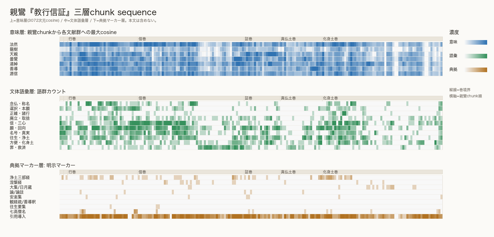

# Shinran Three-Layer Sequence 2026-06-04

親鸞『教行信証』SAT safe chunks を横軸にし、意味層・文体語彙層・典拠マーカー層を3段ヒートマップにした。

## 読み方

- 意味層は、各親鸞 chunk から法然・高僧各群への 3072 次元 cosine の最大値。
- 文体語彙層は、辞書ベース語群のカウント。
- 典拠マーカー層は、経名・論釈名・高僧名・引用導入句などの明示マーカー。
- どの層も本文は出力しない。line range、hash、スコア、カウントだけを出す。

## 出力図

## 意味層: 巻別トップ近傍

| 巻 | top | chunks |
| --- | --- | --- |
| 信巻 | 法然 | 22 |
| 化身土巻 | 道綽 | 21 |
| 信巻 | 源信 | 16 |
| 行巻 | 法然 | 14 |
| 化身土巻 | 法然 | 11 |
| 化身土巻 | 源信 | 11 |
| 証巻 | 天親 | 11 |
| 信巻 | 道綽 | 8 |
| 真仏土巻 | 善導 | 8 |
| 行巻 | 源信 | 8 |
| 化身土巻 | 善導 | 7 |
| 信巻 | 曇鸞 | 6 |

## 文体語彙層: 巻別トップ語群

| 巻 | top | chunks |
| --- | --- | --- |
| 信巻 | 信・三心 | 18 |
| 信巻 | 罪・救済 | 17 |
| 化身土巻 | 信・三心 | 15 |
| 行巻 | 願・回向 | 14 |
| 化身土巻 | 願・回向 | 8 |
| 信巻 | 願・回向 | 7 |
| 化身土巻 | 往生・浄土 | 7 |
| 化身土巻 | 方便・化身土 | 7 |
| 行巻 | 念仏・称名 | 7 |
| 証巻 | 往生・浄土 | 7 |
| 化身土巻 | 廃立・取捨 | 6 |
| 真仏土巻 | 往生・浄土 | 6 |

## 典拠マーカー層: 巻別トップマーカー

| 巻 | top | chunks |
| --- | --- | --- |
| 化身土巻 | 引用導入 | 57 |
| 信巻 | 引用導入 | 52 |
| 行巻 | 引用導入 | 31 |
| 真仏土巻 | 引用導入 | 21 |
| 証巻 | 引用導入 | 18 |
| 行巻 | 七高僧名 | 4 |
| 化身土巻 | 七高僧名 | 2 |
| 序 | 引用導入 | 2 |
| 教巻 | 引用導入 | 2 |
| 信巻 | 七高僧名 | 1 |
| 化身土巻 | 大集/日月蔵 | 1 |

## 注意

- 意味層の最大 cosine は典拠関係の証明ではない。
- 文体語彙層と典拠マーカー層は辞書ベースの最小版であり、引用文の立場と親鸞自身の立場をまだ分けていない。
- この図は、三層が一致する場所とズレる場所を探すための分析図である。

## データ

- `data/outputs/shinran_three_layer_sequence_2026-06-04_text-embedding-3-large_700_100.json`
- `data/outputs/shinran_three_layer_sequence_2026-06-04.csv`
